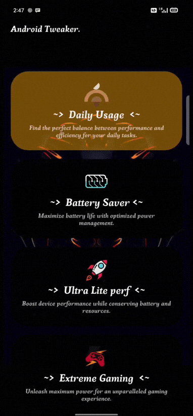

 

 <h1 align="center"><b> Android Tweaker </b></h1> 

*`Android Tweaker (kernel spectrum) module.Optimize your Kernel overall performance and battery backup`*

 

 `Requirements`:

- *Magisk 20.0+*
- *ArmV7 32Bit*
- *ArmV8 64Bit*
- *OS 6.0+*

------------------------------
~> `Battery Saver`:
- *Optimize battery life by reducing power usage and enhancing energy efficiency.*

~> `Daily usage`:
- *Achieve the perfect balance between battery life and performance for seamless daily tasks.*

~> `Ultra Lite Perf`:
- *Enhance your device's performance while conserving battery and minimizing resource usage for optimized functionality.*

~> `Extreme Gaming`:
- *Max out Kernel,CPU and GPU power levels for Maximum performance during gameplay.*
------------------------------
`How to install`:
- *Just flash and reboot there no terminal commands to active anything after reboot apk installed automatically change profiles using app*

`Compatible`:
- *Compatible with all ROMs/kernels/Processors.*

`Any chance of bootloop` ?
- *no bootloop, not possible!*
